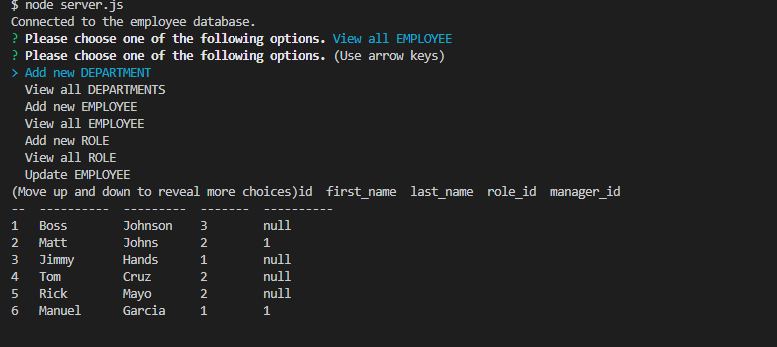

 (https://img.shields.io/badge/license-MIT-success?style=plastic)
  # Employee Tracker

  ## Project Description
  This project utilized SQL amongst other technologies to display company data stored in a database. This will show the user employee names, roles, and salaries at a glance.

  ## Installation

  Clone down the repository. Second, run "npm i" to ensure all relevant modules are installed. Third, type in "node server.js" into the terminal to run the project files. Fourth, answer prompts depending on what the user would like to do.

  ---------------------------------------------
  ## Usage
  
  This project organizes company information in an accessible manner

  ---------------------------------------------

  ## License

  MIT

  ---------------------------------------------

  ## Questions

  If you have any questions please feel free to contact me at:
  1) Github: https://github.com/AndrewPGibbs

  ---------------------------------------------

  ### License

  Licensed under the MIT license. (https//choosealiscense.com/licenses/MIT/)
